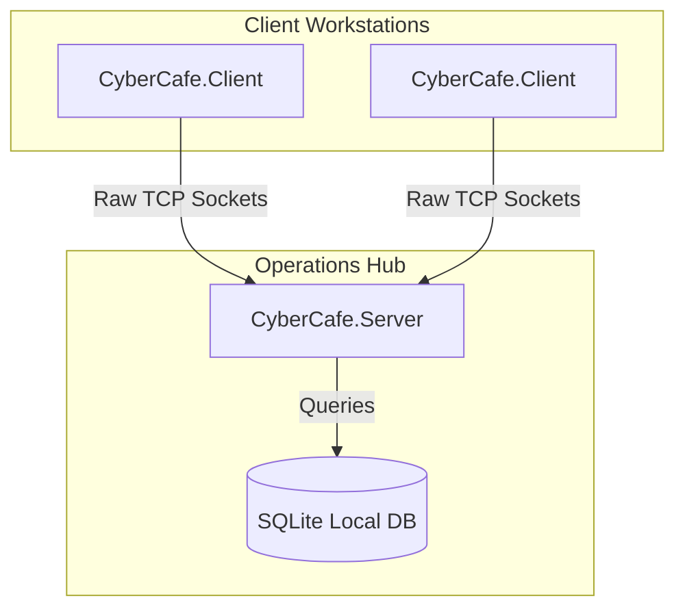
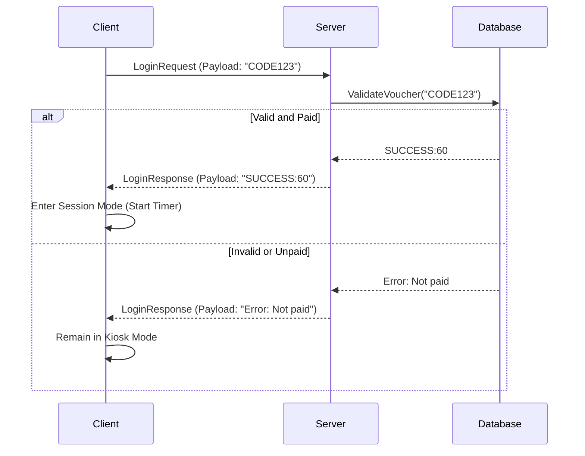

# Cyber Cafe System - Technical Developer Guide

Welcome to the technical documentation for the Cyber Cafe Management System. This guide provides an in-depth look at the architecture, database schema, networking protocols, and security models used in the system.

## 1. High-Level Architecture

The system utilizes a standard Client-Server architecture built in C# (.NET 8.0) and Windows Forms.

- **`CyberCafe.Core`**: Shared DLL layer containing models, packet structures, and the global Data Access Layer (DAL).
- **`CyberCafe.Server`**: Administrative desktop application that listens for client connections, validates vouchers, and manages the SQLite database.
- **`CyberCafe.Client`**: Kiosk-mode application deployed on individual physical workstations.

## 2. Database Schema (SQLite)

The system uses a server-side local `SQLite` database named `CyberCafeDB.db`. Write-Ahead Logging (WAL) is enabled for better concurrency.

### Core Tables
| Table | Description | Key Fields |
|-------|-------------|------------|
| **Employees** | Stores admin/cashier credentials. | `EmployeeID`, `FullName`, `Username`, `PasswordHash`, `Role` (0=Admin, 1=Cashier) |
| **Devices** | Authorized client workstations. | `DeviceID`, `MACAddress`, `FriendlyName` |
| **Vouchers** | Prepaid codes for client access. | `VoucherCode`, `TotalMinutes`, `RemainingMinutes`, `Status` (0=Unsold, 1=Active, 2=Exhausted, 3=Paused) |
| **Sessions** | Historical record of usage sessions. | `SessionID`, `DeviceID`, `StartTime`, `EndTime` |
| **Transactions** | Audit trail of financial events. | `TransID`, `EmpID`, `TransType`, `Amount` |

## 3. Networking Protocol

Communication relies on custom asynchronous TCP socket processing encapsulated within the Server and Client network engines.

### The `NetworkPacket` Structure
Communications are heavily typed using the `NetworkPacket` class.
- **Type**: `PacketType` (Enum)
- **Payload**: String data (e.g., `"SUCCESS:60"` or `"VOUCHER:XYZ123:30"`)
- **SenderId**: Client's MAC Address.

### Authentication Sequence

### Server Commands
The server can push administrative commands targeting a specific MAC address:
- `CommandShutdown`
- `CommandRestart`
- `CommandForceLogout`
- `CommandMessage` (Triggers a MessageBox popup on the client)

## 4. Security & Authentication Models

### Password Cryptography
Employee passwords are hashed utilizing native `.NET` namespaces (`System.Security.Cryptography.SHA256`). Hashes are persisted in the database as lowercase hexadecimal strings.

### Client Kiosk Mode Limitations
When unauthorized (no active voucher payload), `CyberCafe.Client` aggressively secures the workstation:
- **TopMost Form Enforcement**: The UI maximizes and forces itself to the top of the window stack without borders.
- **Keyboard Hooking**: Intercepts native system keystrokes to prevent alt-tabbing and Windows key circumvention.
- **Task Manager Suppression**: A background thread continuously polls for and kills `taskmgr` processes by name.

**Emergency Exit**: Technicians can trigger the exit popup using the key combination `Ctrl+Shift+Alt+X` and entering the root administrative password (default `1234`).

## 5. Extensibility Guide

If you intend to add new features to the solution:
1. **New Screens/Forms**: Create them in the respective `Views` folders of the Server or Client.
2. **New DB Tables**: Append your raw SQL schema definitions to the `InitializeDatabase()` method inside `CyberCafe.Core.Data.DatabaseManager.cs`.
3. **New Network Commands**: 
   - Append a new enum element to `PacketType` in `NetworkPacket.cs`.
   - Update `ExecuteCommand` in `FormClient.cs` or the Server listener handlers to react to the new payload constraint.
